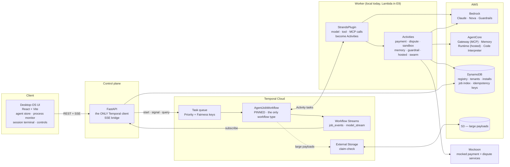
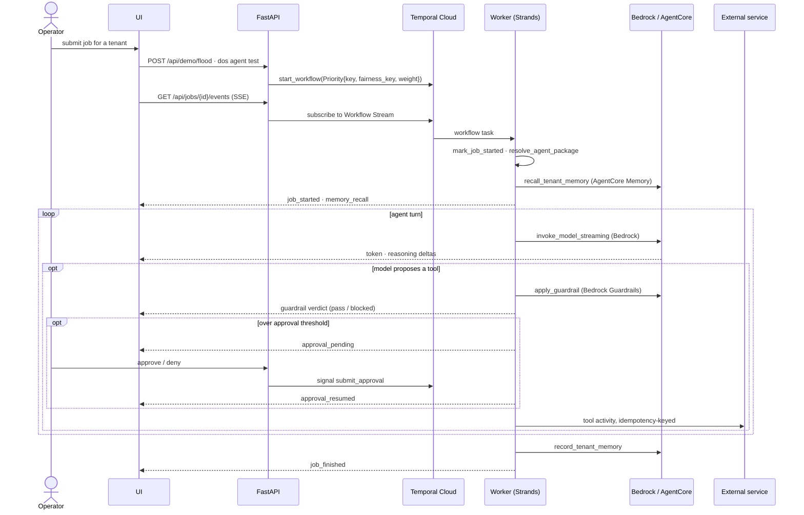

# Durable Agent Control Plane

**An operating system for agents.** Strands is the inner harness — it runs the turn. Temporal is the outer durable harness — it runs the durable process the turns live inside. AWS supplies the silicon.

> Strands makes the agent think. Temporal makes the system trustworthy.

This is a working multi-tenant control plane, and a **boilerplate you can fork**. The four reference agents are examples of what runs on it, not the point of it — the runtime is the deliverable: one generic workflow, manifest-driven agent packages, fair multi-tenant scheduling, safe version routing, and crash-safe side effects.

Adding an agent is a **directory**, not a code change: `manifest.yaml` + `procedure.sop.md`, zero workflow code, zero UI code. See [CONTRIBUTING.md](CONTRIBUTING.md).

---

## The three proofs

Everything here exists to keep these working. They are the acceptance test for the whole project.

| # | Claim | How it is shown | Verify |
|---|---|---|---|
| 1 | **Fairness protects everyone else** | Fairness off → one tenant floods the queue → other tenants' p95 wait collapses. Fairness on → same flood → protected tenants hold steady. | `make verify-tenant-priority` |
| 2 | **Safe version routing** | Deploy v2 with sessions mid-reasoning. In-flight sessions stay pinned to v1 and finish cleanly; new sessions start on v2. | `make verify-pinning`, `make verify-versioning` |
| 3 | **Kill and resume without duplication** | Kill the worker at a tool boundary right after a payment. Restart. Sessions resume at the same turn and the payment counter still reads exactly 1. | `make verify-kill-resume` |

No mocked numbers anywhere: every figure on screen comes from a real Temporal or AWS call.

---

## Architecture



**The rules that shape this diagram:** the UI never talks to Temporal — the API is the sole client. There is exactly **one** workflow type. Anything that is not Temporal event history lives in DynamoDB — no second datastore, no Redis, no broker.

## One job, end to end



**Why the durability claims hold:** every model call, tool call, and MCP call is a Temporal Activity, so a worker crash resumes at the last completed step — and consequential tools are idempotency-keyed, so the side effect happens exactly once (proof 3). A session paused for human approval costs no worker resources and can wait for days.

---

## The stack, and what each part is doing

| Layer | Choice | What it buys |
|---|---|---|
| **Orchestration** | Temporal Cloud (Python SDK) — never a local server | Durable execution, the outer harness |
| **Agent framework** | Strands via `temporalio.contrib.strands` | Model/tool/MCP calls dispatched as Activities by `StrandsPlugin` |
| **Models** | Amazon Bedrock — Claude, Nova | Named in the manifest (`bedrock-claude`), never a raw model id |
| **Tools** | AgentCore Gateway (MCP) via `TemporalMCPClient` | Tools re-listed per turn, tenant-portable catalog keys |
| **Memory** | AgentCore Memory, tenant-scoped | Recall across sessions for a tenant |
| **Guardrails** | Bedrock Guardrails | A deterministic gate between the model proposing a tool and the tool running |
| **Hosted agents** | AgentCore Runtime | Tier-3 lane: someone else's agent, registered by ARN, no repo access |
| **Sandboxes** | AgentCore Code Interpreter | Untrusted analysis, invoked from an Activity |
| **Large payloads** | S3 via Temporal External Storage | Claim-check keeps event history small |
| **App database** | DynamoDB | Registry, tenants, installs, job index, idempotency keys |
| **Frontend / API** | React + Vite + Tailwind / FastAPI | Desktop-OS shell; API is the sole Temporal client |
| **Mocked services** | Mockoon | The payment and dispute services the agents actually call |

### Temporal features this leans on

| Feature | Used for | Status |
|---|---|---|
| **Priority & Fairness** | Proof 1 — per-tenant fairness keys and weights | **Public Preview**, paid Temporal Cloud add-on |
| **Worker Deployment Versioning** (`PINNED`) | Proof 2 — in-flight sessions never move | **Public Preview** |
| **Serverless Workers on Lambda** | The deployed worker lane (E9) | **Public Preview** — *to be completed* |
| **Workflow Streams** (`temporalio.contrib.workflow_streams`) | Live token/tool/guardrail events to the UI, no custom event bus | **Experimental** |
| **External Storage** (S3 claim-check) | Large tool payloads out of event history | **Preview** |
| **`temporalio.contrib.strands`** | The Strands ↔ Temporal integration itself | **Experimental**, version-pinned |
| Signals, queries, continue-as-new, retries, idempotency | Human approval, session state, crash-safe side effects | GA |

Preview features are labelled here, in code comments, and in the stage narration. Nothing claims GA that is not GA.

---

## Repo layout

```
agents/                  # agent packages — the extensibility surface
  _template/             #   copy this to start
  invoice_exception/     #   tier 2 · tools + MCP + swarm + structured output
  incident_triage/       #   tier 1 · SOP only, no tools (the flood generator)
  dispute_resolution/    #   tier 2 · read-only + consequential tools, sandbox
  vendorcheck/           #   tier 3 · hosted on AgentCore Runtime, manifest only
  returns_triage/        #   tier 1 · the worked example — two files, no code
app/
  workflows/             # AgentJobWorkflow — the ONLY workflow type
  activities/            # model, tools, guardrail, sandbox, memory, payment, hosted
  registry/              # manifest loader, DynamoDB repository, priority, metrics
  api/                   # FastAPI, SSE bridge, sole Temporal client
  worker.py
cli/                     # `dos` CLI — init, validate, test, publish, demo controls
ui/                      # React desktop-OS control plane (+ Playwright e2e)
infra/                   # SAM templates, Lambda targets, hosted agent source
mocks/                   # Mockoon collections
scripts/                 # every `make verify-*` entry point
docs/
  AWS_SETUP.md           # manual AWS steps, append-only — reproduce the environment
  DECISIONS.md           # ADR log — why things are the way they are
  BACKLOG.md             # epics → stories → tasks, with what is done and what is not
  MULTI_AGENT.md         # Swarm inside a job vs agents between jobs
  RUNBOOK.md             # operating the demo from a laptop — terminals, preflight, failure modes
  DEMO_SCRIPT.md         # the run of show — to be completed (E8.1)
```

---

## Quickstart

**Prerequisites:** Python 3.12 + [uv](https://docs.astral.sh/uv/), Node 20+, a **Temporal Cloud** namespace and API key, an AWS account with Bedrock model access, and `mockoon-cli` (`npm i -g @mockoon/cli`).

There is no local Temporal server and no Docker Compose — this runs against Temporal Cloud and real AWS, by design.

```bash
git clone <this repo> && cd durable-agent-control-plane
uv sync
cp sample.env .env          # fill in Temporal + AWS values
```

1. **Provision AWS by hand** — follow [docs/AWS_SETUP.md](docs/AWS_SETUP.md) top to bottom (DynamoDB table, IAM, Bedrock Guardrail, AgentCore Gateway/Memory/Runtime, S3 bucket) and put the resulting ids in `.env`. Nothing here creates AWS resources for you, so a fork can reproduce the environment exactly.
2. **Seed tenants and publish agents**
   ```bash
   uv run dos tenant add acme --name Acme --tier platinum --priority-key 3 --fairness-weight 3.0
   make agent-publish ID=invoice-exception
   uv run dos tenant install acme invoice-exception
   ```
3. **Run it** — four terminals
   ```bash
   make mockoon      # mocked payment + dispute services on :3001
   make worker       # export AWS_PROFILE as a real env var, see gotchas below
   make api          # :8000
   make ui           # :5173
   ```
4. **Make the worker's build current** — a versioned worker receives *no* tasks until you do this:
   ```bash
   uv run dos demo ramp --version <BUILD_ID from .env> --percent 100
   ```
5. **Run a job**
   ```bash
   make agent-test ID=invoice-exception PROMPT="Invoice INV-1001 for \$180 from Globex Retail failed PO matching."
   ```

**Two gotchas that look like silent hangs:**
- Start the worker with `AWS_PROFILE` exported as a real OS env var (`AWS_PROFILE=… make worker`). `.env` alone is not enough — Bedrock's client reads the ambient environment.
- After any `BUILD_ID` bump, re-run step 4 *after* a worker has polled with the new id. The version does not exist server-side until then.

### Driving the proofs by hand

The same controls the UI's System Controls pane calls, available from the CLI:

```bash
uv run dos demo fairness --off              # proof 1 — then flood, and watch p95 collapse
uv run dos demo flood --tenant initech --count 200
uv run dos demo metrics                     # per-tenant p95 wait, from real job timings
uv run dos demo fairness --on               # same flood, protected tenants hold

uv run dos demo ramp --version v2 --percent 100   # proof 2 — new sessions only
uv run dos demo kill-worker --at-tool-boundary    # proof 3 — crash after the next payment
uv run dos demo payment-count               # the counter that must still read 1
```

Every flood job is a real Bedrock call, so pick `--count` deliberately.

---

## Adding an agent

| Tier | Who | What you write |
|---|---|---|
| 1 | Analyst, no code | `manifest.yaml` + `procedure.sop.md` |
| 2 | Developer | Tier 1 + a custom activity tool in `app/activities/` |
| 3 | External team | Your own agent on AgentCore Runtime, registered by ARN |

```bash
make agent-init ID=returns-triage       # scaffold from agents/_template/
make agent-validate ID=returns-triage   # model, tools, placeholders, policy
make agent-publish ID=returns-triage    # writes a registry row — no redeploy, no restart
make agent-test ID=returns-triage PROMPT="..."
```

A tier-1 author who has never heard of Temporal still inherits fair scheduling, crash recovery mid-turn without duplicated side effects, and safe upgrades while their sessions are in flight.

**Worked example:** [`agents/returns_triage/`](agents/returns_triage/) is a complete tier-1 agent — a manifest and an SOP, no Python at all — authored entirely through the loop above and verified by `make verify-returns-triage`. Full guide: [CONTRIBUTING.md](CONTRIBUTING.md).

---

## Verification

There are **no unit tests and no mocks** here, deliberately. Verification means running the real thing against Temporal Cloud and real AWS, from a repeatable entry point.

```bash
make ci                       # ruff + mypy
make replay                   # non-determinism guard: replays real recorded histories
make verify                   # DynamoDB registry round-trip
make verify-agents            # all native reference agents, real jobs
make verify-returns-triage    # the worked tier-1 example, one job per SOP rule
make verify-payment           # proof 3's idempotency mechanism
make verify-kill-resume       # proof 3 end to end: crash mid-tool, restart, count == 1
make verify-pinning           # proof 2: in-flight session survives a deploy
make verify-tenant-priority   # proof 1: real Priority on real workflows
make verify-streaming         # live tokens + tool calls over the real SSE route
make verify-guardrail         # guardrail verdicts reach the session terminal
make verify-interrupt         # human approve/deny mid-reasoning
make verify-sandbox-isolation # Code Interpreter isolation across a crash
make verify-external-storage  # S3 claim-check actually shrinks event history
make verify-hosted            # tier-3 hosted lane on AgentCore Runtime
make e2e                      # Playwright against the real UI and real stack
```

Run `make replay` after any change under `app/workflows/`, and bump `BUILD_ID` when workflow behaviour changes.

---

## Project status

Built and verified against real AWS and Temporal Cloud:

| Epic | | |
|---|---|---|
| E0 Foundations | ✅ | repo, config, DynamoDB single-table model |
| E1 Durable agent runtime | ✅ | `AgentJobWorkflow`, tools as activities, human interrupt |
| E2 Agent package system | ✅ | manifests, registry, `dos` CLI, four reference agents |
| E3 Multi-tenancy & fairness | ✅ | **proof 1** |
| E4 Control plane API & streaming | ✅ | FastAPI, Workflow Streams → SSE, token streaming |
| E5 Desktop-OS UI | ✅ | four panes, stage-legibility pass |
| E6 Versioning & chaos | ✅ | **proofs 2 and 3** |
| E7 AWS services | ✅ | Gateway, Memory, Guardrails, Code Interpreter, External Storage, hosted lane, multi-agent |
| E8 Demo hardening | 🔜 | **to be completed** |
| E9 Deploy | 🔜 | **to be completed** |
| E10 Open-source release | 🚧 | in progress — this README |

### Known gaps — to be completed

Tracked in [docs/BACKLOG.md](docs/BACKLOG.md); listed here so nothing is discovered the hard way.

- **Deployment (E9).** Everything runs locally today against Temporal Cloud and real AWS. SAM templates, Serverless Workers on Lambda, API + Mockoon on App Runner, and UI on Amplify are not built.
- **Demo hardening (E8.1/E8.2).** `docs/DEMO_SCRIPT.md` is still a placeholder, and there is no full-run recording; Mockoon collection coverage is not audited. `make demo-reset`, `make demo-seed` and `make preflight` do exist, and [docs/RUNBOOK.md](docs/RUNBOOK.md) covers operating the stack from a laptop.
- **Rehearsals.** The 200-job fairness dress rehearsal, the 10× kill/restart rehearsal, and a 10-metre projector legibility pass are all still outstanding (each verified at reduced scale).
- **Guardrail demonstrability.** The `OffPolicyPayment` denied topic is close to unreachable through a model turn — its definition overlaps the model's own refusal boundary, so the model declines before the gate is consulted. Reachable categories (e.g. the PII and profanity policies) are what the verification uses. See [docs/DECISIONS.md](docs/DECISIONS.md).
- **Open-source release (E10).** Temporal Code Exchange publication is not done.
- **No per-tenant tool-authorization boundary.** Isolation is installs, priority/fairness, and memory namespacing; the manifest — validated against the tool catalog at publish time — is the control point on what an agent may call. Fine when you author the packages; not sufficient for genuinely untrusted tenant packages.

---

## Docs

| | |
|---|---|
| [CONTRIBUTING.md](CONTRIBUTING.md) | Add an agent — the three tiers, manifest fields, SOP authoring |
| [docs/AWS_SETUP.md](docs/AWS_SETUP.md) | Every manual AWS step, reproducible from scratch |
| [docs/DECISIONS.md](docs/DECISIONS.md) | ADR log — why, including the mistakes and what they cost |
| [docs/BACKLOG.md](docs/BACKLOG.md) | Epics → stories → tasks, with real verification notes |
| [docs/MULTI_AGENT.md](docs/MULTI_AGENT.md) | Swarm inside one job vs agents across jobs, and the durability tradeoff |
| [docs/RUNBOOK.md](docs/RUNBOOK.md) | Running the demo from a laptop — the four terminals, the pre-delivery timeline, and the failure-mode table |
| [CLAUDE.md](CLAUDE.md) | The design non-negotiables this codebase is held to |

## License

MIT — see [LICENSE](LICENSE).
